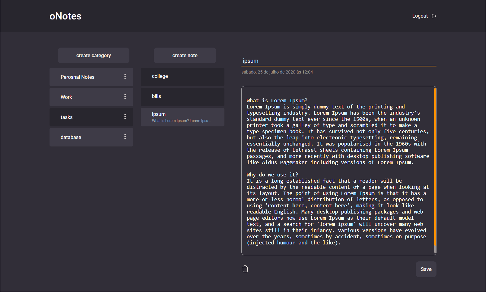
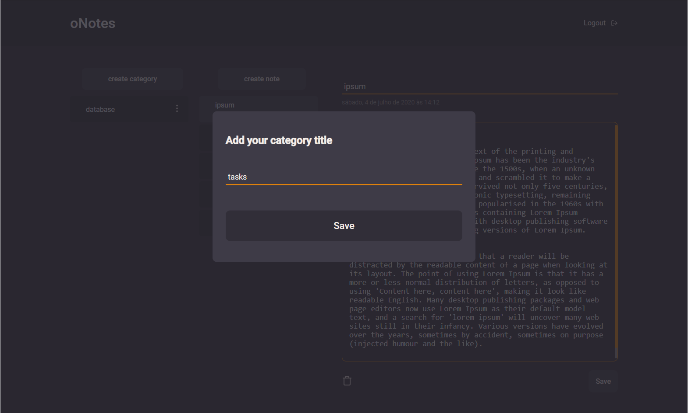
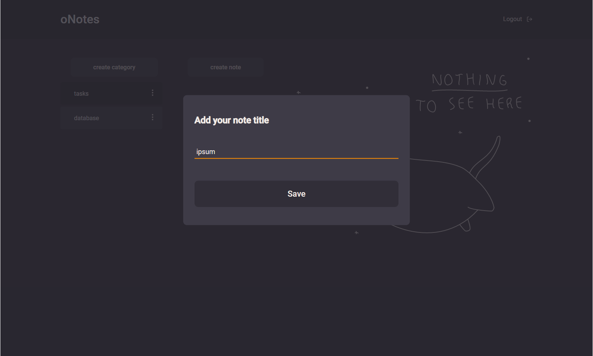
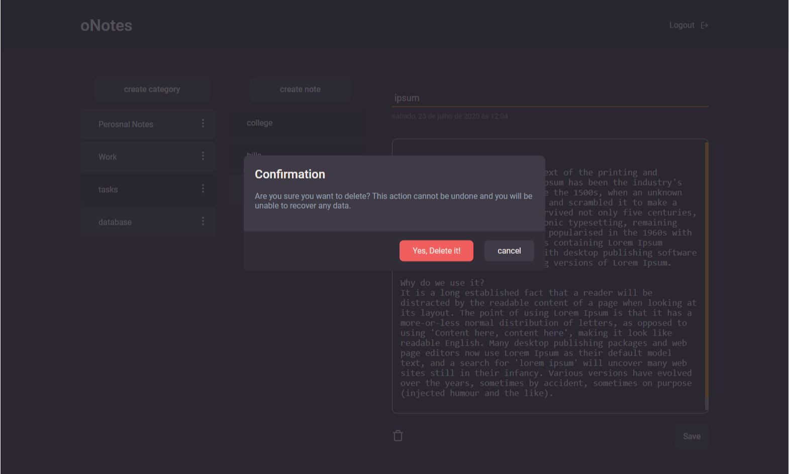
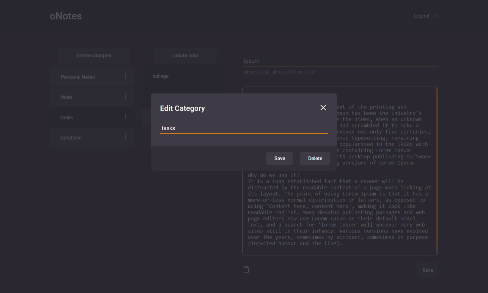
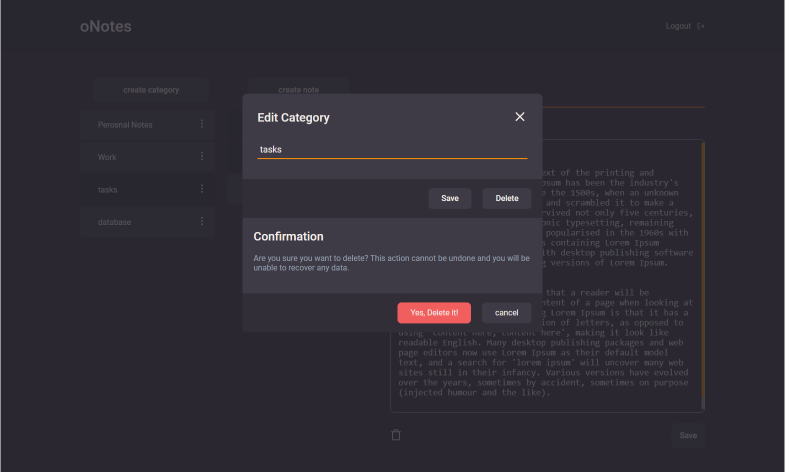

<h1 align="center">
    oNotes
</h1>

## oNotes
Esse é um projeto frontend de um sistema de anotações


<p align="center">
  <a href="#tecnologias">Tecnologias</a>&nbsp;&nbsp;&nbsp;|&nbsp;&nbsp;&nbsp;
  <a href="#projeto">Projeto</a>&nbsp;&nbsp;&nbsp;|&nbsp;&nbsp;&nbsp;
  <a href="#começando">Começando</a>&nbsp;&nbsp;&nbsp;|&nbsp;&nbsp;&nbsp;
  <a href="#telas-do-projeto">Telas do projeto</a>&nbsp;&nbsp;&nbsp;|&nbsp;&nbsp;&nbsp;
  <a href="#licença">Licença</a>
</p>


## Tecnologias

Esse projeto foi desenvolvido com algumas tecnologias, entre quais são:


- [axios](https://github.com/axios/axios)
- [react](https://reactjs.org/)
- [react-router-dom](https://reactrouter.com/web/guides/quick-start)
- [react-modal](https://github.com/reactjs/react-modal)
- [styled components](https://styled-components.com/)


## Projeto

oNotes é um projeto de anotações, onde poderá ter suas notas em todo lugar
esse projeto é o frontend da aplicação, e o código do backend está em [onotes back](https://github.com/olucasokarin/onotes-back.git).

Resolvi desenvolver esse projeto quando tive algumas dificuldades de acessar minhas notas do app de notas do meu celular. \
E resolvi desenvolver meu próprio projeto para tal, sendo que ainda terá um app feito em react native.


## Começando

 1. Clone esse repositorio ```git clone https://github.com/olucasokarin/onotes-web.git```
 2. Mova para a directorio: ```cd onotes-web```
 3. Run ```yarn``` para instalar as dependências
 4. Run ```yarn start```


## Telas do projeto

### Tela principal


### Tela do modal de criação de categoria


### Tela do modal de criação de notas


### Tela do modal de confirmação antes de deletar a nota


### Tela do modal de edição da categoria


### Tela do modal de confirmação antes de deletar a categoria



 ## Licença

Esse projeto está sob a licença MIT. Veja o arquivo [LICENSE](LICENSE) para mais detalhes.

